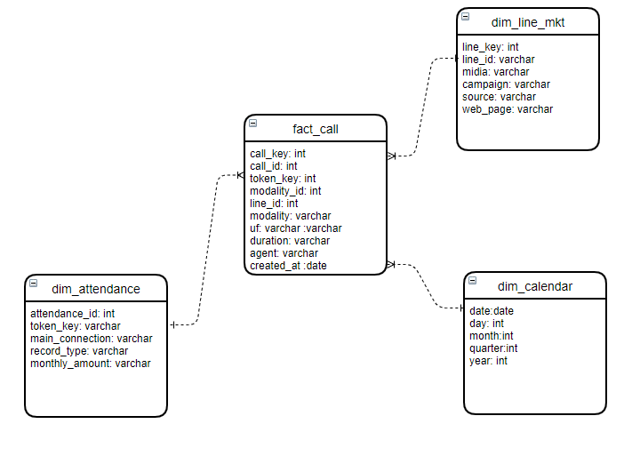
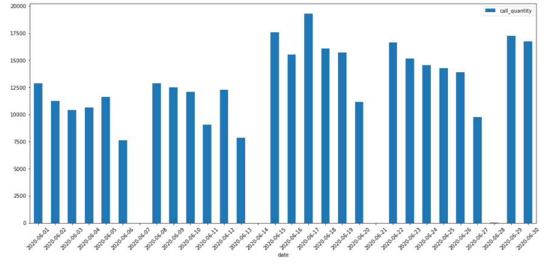
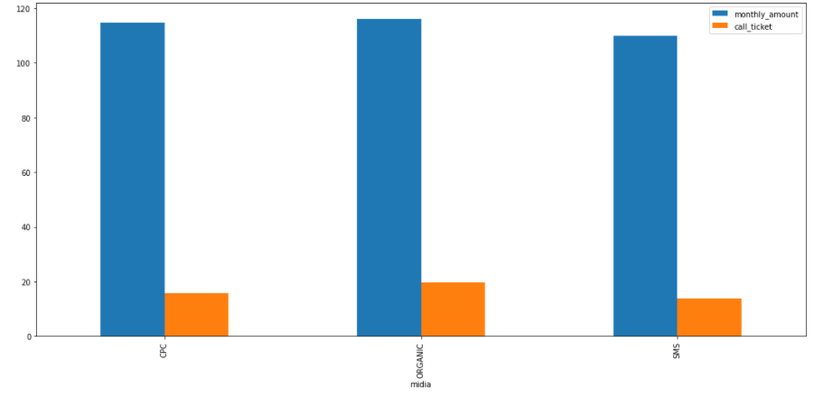
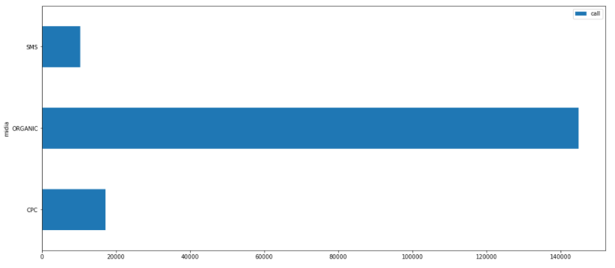
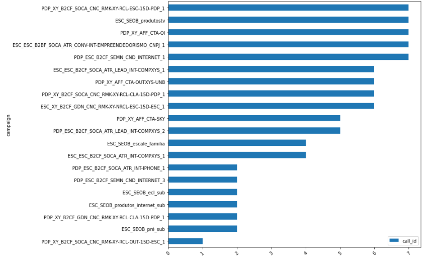
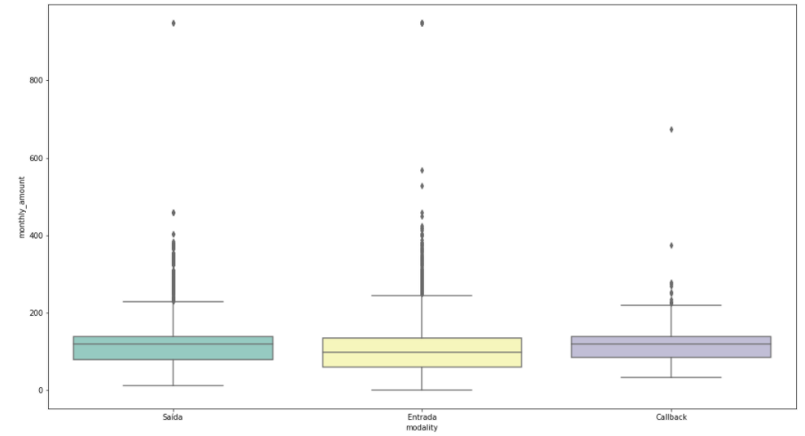
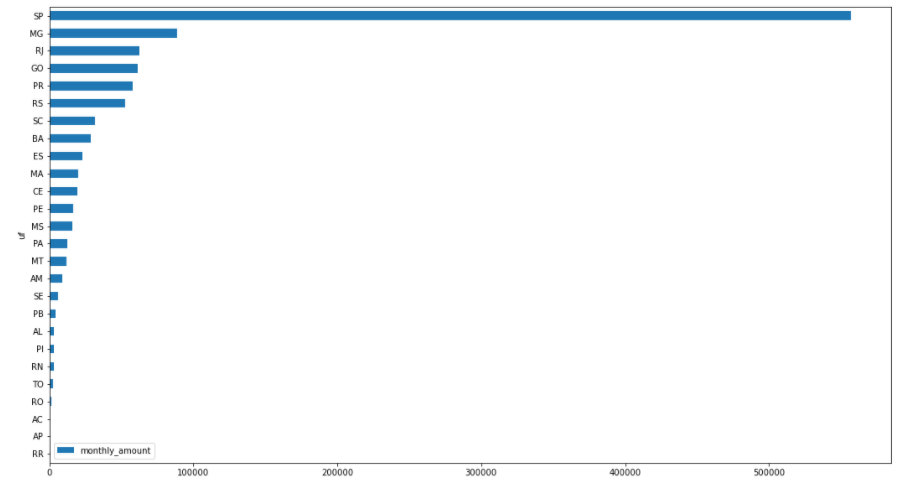

# Case Escale
Case Escale por Rodrigo dos Santos Ramos

## Resumo

Esse diretorio foi criado a fim de participar do processo seletivo na Escale para vaga de Data Analyst.

O código utilizado no case está disponível no [Jupyter Notebook](case-escale-rodrigo.ipynb).

## Estrututa

1. Conexao com banco de dados;
2. Extrair Informações da fonte de dados;
3. Transformação dos dados;
4. Ilustracao dos graficos;

## Conexão com fonte de dados 

Para me conectar à fonte de dados criei a seguinte função:
```Python
DB_HOST = '****'
DB_NAME = '****'
DB_PORT = '****'
DB_USER = '****'
DB_PASS = '****'
SPARK_APP ='****'

def tableReader(tableName):
  global DB_HOST
  global DB_NAME
  global DB_PORT
  global DB_USER
  global DB_PASS
  tempDf = spark.read \
            .format("jdbc") \
            .option("url", f"jdbc:postgresql://{DB_HOST}:{DB_PORT}/{DB_NAME}") \
            .option("dbtable", tableName) \
            .option("user", DB_USER) \
            .option("password", DB_PASS) \
            .option("driver", "org.postgresql.Driver") \
            .load()
  return tempDf
```
  
 ## Processo de extração dos dados  
 
```python
attendacesDf = tableReader("attendances")
attendancesCallsDf = tableReader("attendances_calls")
lineMKTFinalDf = tableReader("lines_mkt_final")
callHistoryQueueDf = tableReader("call_history_queue")
telephonyTypeDf = tableReader("telephony_types")
```

## Transformação dos dados - ETL
 
Para o processo de **ETL**, realizei tratamentos dos dados e criei tabelas fato e dimensões.
 
## Dimensão

* `dim_attendance`:  Agrupamento entre as tabelas `attendances_calls` e `attendances`.
* `dim_line_mkt`: Sua origem foi a tabela `lines_mkt_final`, porem nessa nova estrutura, ela passou a conter apenas as colunas que achei importante para realizar os indicadores.
* `dim_calendar`: Tabela de calendário.

## Fato

* Tabela `fact_call`:  Agrupamento entre as tabelas `telephony_types` e `calls_history_queue`, onde trouxe para dentro do fato, as colunas relevantes. 

Após o processamento, a modelagem dimensional ficou na seguinte estrutura



## Perguntas a serem respondidas

1. Qual foi o número de ligações por dia?

> A figura abaixo ilustra o resultado obtido
 


```sql
 SELECT  DC.DATE,
        COUNT(FC.CALL_ID) CALL_QUANTITY
FROM    DIM_CALENDAR DC
LEFT JOIN
        FACT_CALL FC
ON      FC.CREATED_AT = DC.DATE
WHERE   DC.YEAR = 2020
AND     DC.MONTH = 6
GROUP BY 
        DC.DATE
ORDER BY 
        DC.DATE
```

2. Qual o ticket médio das vendas e das ligações por mídia?
 
Para chegar a esse resultado, realizei a soma do valor mensal e contagem distinta das ligações que possuem vendas.
 


```sql
  SELECT  DL.MIDIA,
          SUM(COALESCE(DA.MONTHLY_AMOUNT, 0)) /
          COUNT(DISTINCT CASE WHEN DA.RECORD_TYPE = 'Venda' THEN FC.CALL_ID END) AS MONTHLY_AMOUNT,
          SUM(COALESCE(DA.MONTHLY_AMOUNT, 0)) / 
          COUNT(DISTINCT FC.CALL_ID) AS CALL_TICKET
  FROM    FACT_CALL FC
  INNER JOIN
          DIM_ATTENDANCE DA
  ON      DA.TOKEN_KEY = FC.TOKEN_KEY
  INNER JOIN
          DIM_LINE_MKT DL
  ON      DL.LINE_ID = FC.LINE_ID
  GROUP BY
          DL.MIDIA
```
 
3. Qual o número de ligações receptivas por campanha, por status final da ligação e tipo de mídia, sendo todos apresentados em uma mesma visualização?

Quantidade de atendimentos por midia.



```sql
SELECT DM.MIDIA
      ,COUNT(DISTINCT FC.CALL_ID) AS CALL 
FROM   DIM_LINE_MKT DM
LEFT JOIN 
       FACT_CALL FC
ON     DM.LINE_ID = FC.LINE_ID         
WHERE  FC.MODALITY = 'Entrada'
GROUP BY
       DM.MIDIA
```

Quantidade de ligacoes por campanha.



```sql
SELECT 
        DM.CAMPAIGN
       ,COUNT(DISTINCT FC.CALL_KEY) AS CALL_ID 
FROM DIM_LINE_MKT DM
LEFT JOIN
        FACT_CALL   FC
ON      DM.LINE_ID  = FC.LINE_ID    
WHERE   FC.MODALITY ='Entrada'
GROUP BY 
        DM.CAMPAIGN
ORDER BY 
        CALL_ID ASC
LIMIT 20
```

## Outros indicadores

4. Valor de vendas por ligação 
> Valor de vendas por modalidade de ligação. 



5. Valor de vendas por estado

> Achei interessante realizar um indicador onde possa mostrar quais os estados que mais realiza compra, essa informação pode ser relevante para possíveis promoções e mudança de estratégia a fim de alavancar as vendas em estados que menos consome, com base nos estados de maior sucesso de vendas.


 
 ```sql
SELECT  FC.UF,
        SUM(COALESCE(DA.MONTHLY_AMOUNT, 0)) AS MONTHLY_AMOUNT
FROM    FACT_CALL FC 
LEFT JOIN
        DIM_ATTENDANCE DA
ON      FC.TOKEN_KEY = DA.TOKEN_KEY  
WHERE   DA.RECORD_TYPE ='Venda'
GROUP BY
        FC.UF
ORDER BY 
        MONTHLY_AMOUNT ASC   
```

## Criticas e Sugestões

A base poderia ter de mais dados descritivos e menos codigos, assim ficaria mais fazer presumir algo.
Exemplo, o campo para diferenciar **Venda** e **Não Venda** é um código.
